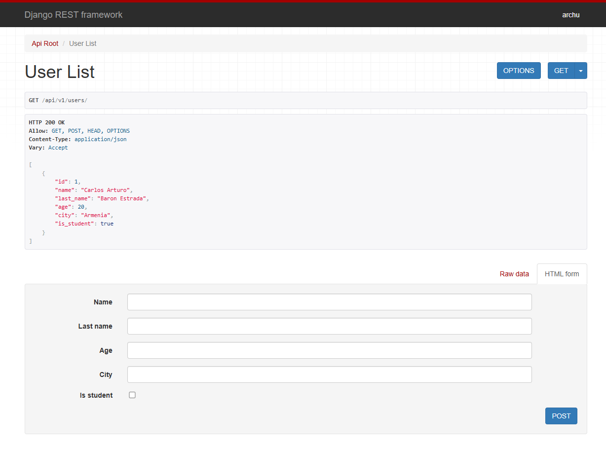
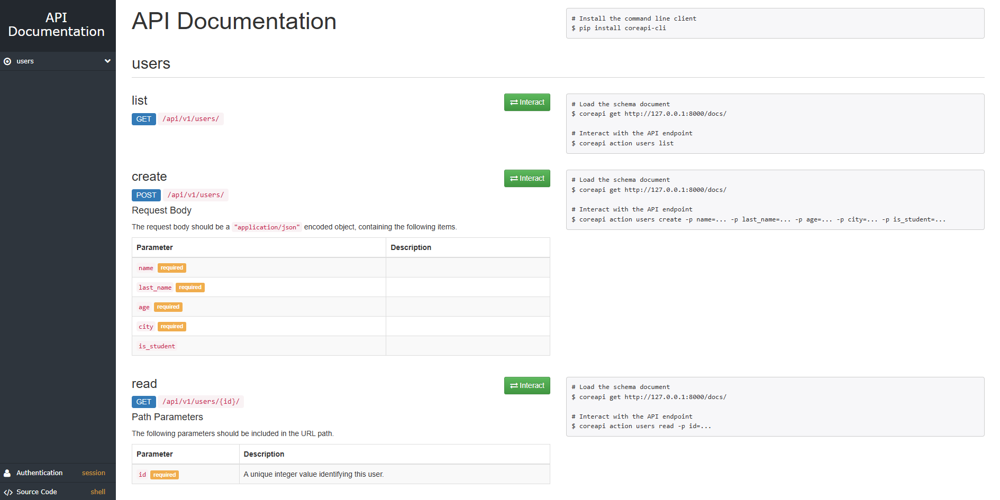
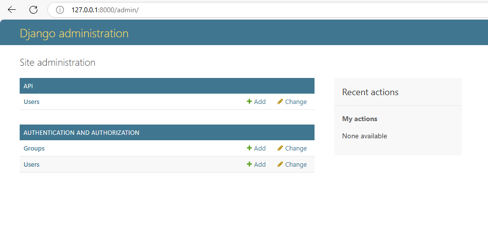

# API REST en Python con Django REST Framework 🐍

Este proyecto implementa una API REST básica utilizando Django y Django REST Framework para gestionar usuarios. Proporciona operaciones CRUD (Crear, Leer, Actualizar, Eliminar) a través de endpoints RESTful.

## Funcionalidades

- API RESTful completa para el modelo `User`
- Documentación automática de la API
- Soporte para operaciones CRUD
- Esquema de la API disponible

## Documentación de la API

La documentación de la API está disponible en:

- `/docs/`: Documentación interactiva generada por coreapi
- `/api/schema/`: Esquema de la API en formato OpenAPI

## Capturas de pantalla

### Vista de la API en el navegador


### Documentación de la API


### Panel de administración


## Estructura del Proyecto

```
├── api/                    # Aplicación principal
│   ├── migrations/         # Migraciones de la base de datos
│   ├── admin.py            # Configuración del panel de administración
│   ├── apps.py             # Configuración de la aplicación
│   ├── models.py           # Modelos de datos
│   ├── serializer.py       # Serializadores para la API
│   ├── tests.py            # Tests unitarios
│   ├── urls.py             # Configuración de URLs de la API
│   └── views.py            # Vistas y lógica de la API
├── crud/                   # Configuración del proyecto Django
│   ├── asgi.py             # Configuración ASGI
│   ├── settings.py         # Configuración del proyecto
│   ├── urls.py             # URLs principales del proyecto
│   └── wsgi.py             # Configuración WSGI
├── screenshots/            # Carpeta con capturas de pantalla
├── manage.py               # Script de gestión de Django
└── README.md               # Este archivo
```

## Modelo de Datos

El proyecto incluye un modelo `User` con los siguientes campos:

- `name`: Nombre del usuario (CharField)
- `last_name`: Apellido del usuario (CharField)
- `age`: Edad del usuario (IntegerField)
- `city`: Ciudad del usuario (CharField)
- `is_student`: Indica si el usuario es estudiante (BooleanField)

## Requisitos

- Python 3.12+
- Django 3.2+ o 5.1+
- Django REST Framework
- coreapi (para documentación)

## Instalación

1. Clona este repositorio:
   ```
   git clone https://github.com/tuusuario/API-REST-PYTHON-DJANGO-framework.git
   cd API-REST-PYTHON-DJANGO-framework
   ```

2. Crea y activa un entorno virtual:
   ```
   python -m venv venv
   source venv/bin/activate  # En Windows: venv\Scripts\activate
   ```

3. Instala las dependencias:
   ```
   pip install django djangorestframework coreapi
   ```

4. Aplica las migraciones:
   ```
   python manage.py migrate
   ```

5. Crea un superusuario (opcional):
   ```
   python manage.py createsuperuser
   ```

6. Inicia el servidor de desarrollo:
   ```
   python manage.py runserver
   ```
